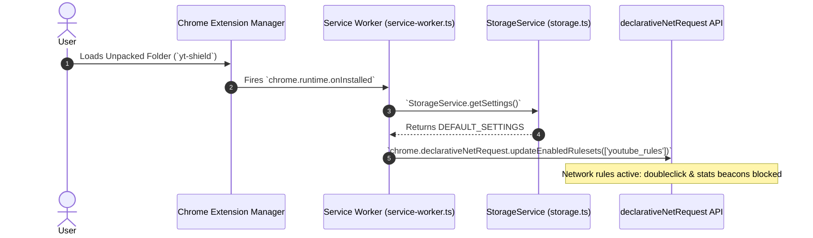
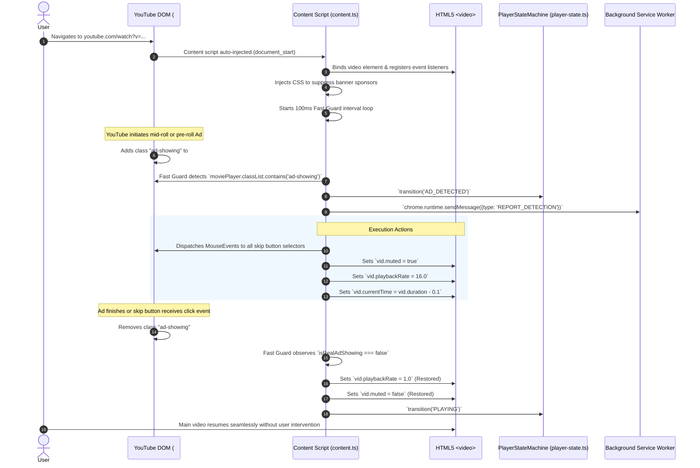
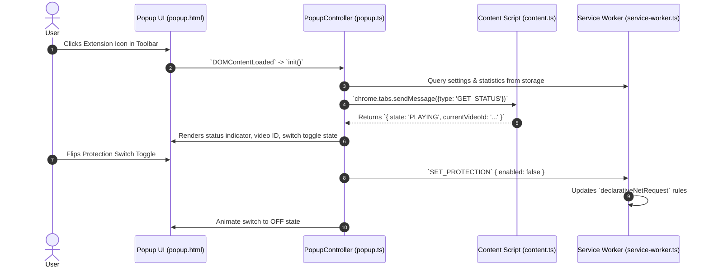
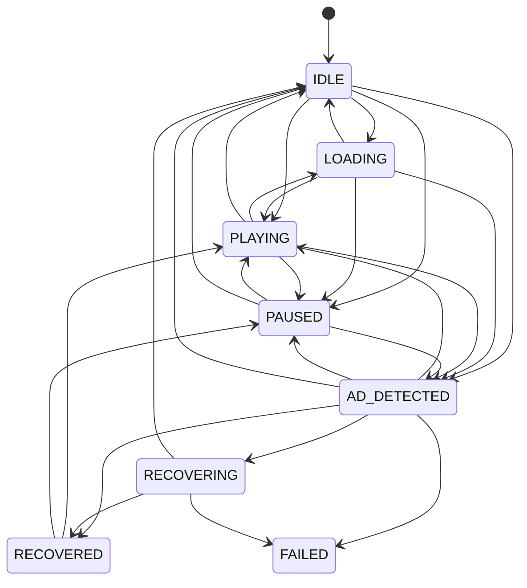

# User Journey — The Project Handbook

A comprehensive, end-to-end walkthrough of **YT Shield**: how users interact with the extension, how every screen and background process functions, and how data travels across all layers of the application.

---

## 1. System Overview & Architecture

**YT Shield** is a Manifest V3 browser extension built with TypeScript, Vite, and Chrome Extension APIs. Its primary mission is to silently detect YouTube video advertisements, speed them through at maximum browser execution speed (16x), auto-click skip buttons with synthesized mouse events, and restore the primary video's playback seamlessly.

### High-Level Architectural Diagram

```
+---------------------------------------------------------------------------------------+
|                                    CHROME BROWSER                                      |
|                                                                                       |
|  +---------------------------+                     +-------------------------------+  |
|  |     YouTube Watch Tab     |                     |        Extension UI           |  |
|  |                           |                     |                               |  |
|  |  +---------------------+  |  chrome.tabs.msg    |  +-------------------------+  |  |
|  |  |  Content Script     |<-+---------------------+->|  Popup UI (popup.html)  |  |  |
|  |  |  (content.ts)       |  |  GET_STATUS         |  +-------------------------+  |  |
|  |  +----------+----------+  |                     |                               |  |
|  |             |             |                     |  +-------------------------+  |  |
|  |             |             |                     |  |  Options (options.html) |  |  |
|  |             v             |                     |  +------------+------------+  |  |
|  |    HTML5 <video> Element  |                     +---------------|---------------+  |
|  +-------------+-------------+                                     |                  |
|                |                                                   |                  |
|                | chrome.runtime.sendMessage                        |                  |
|                v                                                   v                  |
|  +---------------------------------------------------------------------------------+  |
|  |                         Background Service Worker                               |  |
|  |                         (src/background/service-worker.ts)                      |  |
|  |                                                                                 |  |
|  |  - DeclarativeNetRequest Ruleset Manager (blocks tracking beacons)              |  |
|  |  - Central Event Router & Logger                                                |  |
|  |  - Chrome Local Storage Engine (`chrome.storage.local`)                        |  |
|  +---------------------------------------------------------------------------------+  |
+---------------------------------------------------------------------------------------+
```

---

## 2. End-to-End User Journeys

### Journey 1: Installation & Initial Load



1. **User loads the extension** in developer mode or installs it from a web store.
2. The browser registers `background/service-worker.js` as an ES Module worker.
3. The `onInstalled` listener in [`service-worker.ts`](file:///c:/Users/prati/OneDrive/Desktop/YT-Shield/src/background/service-worker.ts) queries [`StorageService.getSettings()`](file:///c:/Users/prati/OneDrive/Desktop/YT-Shield/src/shared/storage.ts).
4. If this is the first install, default preferences are populated:
   - `protectionEnabled`: `true`
   - `networkFiltering`: `true`
   - `playerDetection`: `true`
   - `autoRecovery`: `true`
   - `maxAttempts`: `5`
5. [`RuleManager.updateRules(true)`](file:///c:/Users/prati/OneDrive/Desktop/YT-Shield/src/background/service-worker.ts) executes `chrome.declarativeNetRequest.updateEnabledRulesets`, activating the static rules defined in `rules/youtube-rules.json`.

---

### Journey 2: Watching a YouTube Video (Ad Interception & Skipping)

This is the core operational loop where the user is browsing YouTube:



1. **Page Load**: When the user opens any YouTube video, `content.js` runs automatically.
2. **Instant Banner Suppression**: `injectAdStyles()` appends an inline `<style>` tag to the document `<head>`, immediately collapsing promotional tiles, merchandising shelves, and masthead ads (`#player-ads`, `ytd-ad-slot-renderer`, etc.) with zero flicker.
3. **Guard Activation**: A high-frequency timer (`startFastGuard()`) runs every 100ms and inspects the YouTube player container (`#movie_player`).
4. **Ad Trigger**: When YouTube injects an advertisement, `#movie_player` receives the `ad-showing` class.
5. **Immediate Mitigation**:
   - The script searches for skip button components (e.g. `.ytp-ad-skip-button-modern`, `.ytp-skip-ad-button`, `.ytp-ad-skip-button-slot button`) and fires a synthetic `MouseEvent` with `bubbles: true`.
   - The ad video is muted (`muted = true`).
   - The playback rate is boosted to maximum (`playbackRate = 16.0`).
   - `currentTime` is jumped forward to `duration - 0.1`, forcing unskippable ads to expire in less than 200 milliseconds.
6. **Seamless Normalization**: The moment `#movie_player` drops the `ad-showing` class, `vid.playbackRate` is instantly reset to `1.0`, `vid.muted` is restored to `false`, and the user's selected video continues uninterrupted.

---

### Journey 3: Extension Popup Interaction



1. **Opening Popup**: The user clicks the YT Shield badge in the browser toolbar.
2. **Current Tab Discovery**: `inspectCurrentTab()` uses `chrome.tabs.query({ active: true, currentWindow: true })`.
3. **Live Sync**: The popup asks the active tab's content script for live state via `chrome.tabs.sendMessage`.
4. **Status Display**:
   - If on a YouTube video, displays `● PLAYING` or `● IDLE` with an emerald status light.
   - If ad fast-forward is underway, displays `● AD_DETECTED` with an amber status light.
   - Displays counters for Ads Detected and Ads Recovered today.
5. **Switch Interaction**: Clicking the modern slider toggle flips the master protection setting globally across all open tabs.

---

### Journey 4: Options & Settings Configuration

1. User clicks **Settings** from the popup or right-clicks the extension and selects **Options**.
2. [`options.html`](file:///c:/Users/prati/OneDrive/Desktop/YT-Shield/src/options/options.html) loads in a full tab.
3. User can independently toggle:
   - **Protection**: Master switch.
   - **Player Detection**: DOM observation and fast guard checks.
   - **Network Filtering**: Dynamic declarative network blocking of telemetry.
   - **Automatic Recovery**: Automated skipping and seeking.
   - **Maximum Attempts**: Dropdown (1, 2, 3, 5 retries).
   - **Diagnostic Logging**: Verbose logging in DevTools console.
   - **Clear Statistics**: Resets counters to zero.
4. Each click updates `chrome.storage.local` and notifies the Service Worker via `chrome.runtime.sendMessage({ type: 'UPDATE_SETTINGS' })`.

---

## 3. Data Flow & State Management

### Complete State Machine Graph

The content script operates on an explicit deterministic state machine ([`PlayerStateMachine`](file:///c:/Users/prati/OneDrive/Desktop/YT-Shield/src/content/state/player-state.ts)):



### Storage Schema (`chrome.storage.local`)

| Storage Key | Type | Description |
| :--- | :--- | :--- |
| `yt_shield_settings` | `ShieldSettings` | User configuration flags (`protectionEnabled`, `networkFiltering`, `playerDetection`, `autoRecovery`, `maxAttempts`, `diagnosticLogging`) |
| `yt_shield_statistics` | `ShieldStatistics` | Historical usage metrics (`detected`, `blocked`, `recovered`, `failed`, `lastUpdated`) |
| `yt_shield_version` | `string` | Extension schema version for future storage migrations |

---

## 4. Key Source Files & Responsibilities

| File Path | Primary Responsibility |
| :--- | :--- |
| [`manifest.json`](file:///c:/Users/prati/OneDrive/Desktop/YT-Shield/manifest.json) | Declares Manifest V3 permissions (`storage`, `declarativeNetRequest`, `activeTab`), host permissions (`*://*.youtube.com/*`), content scripts, popup, and option entrypoints. |
| [`vite.config.ts`](file:///c:/Users/prati/OneDrive/Desktop/YT-Shield/vite.config.ts) | Multi-target Vite bundling configuration. Compiles the popup, options, and background service worker into standard chunks while bundling `content.ts` into a standalone, isolated **IIFE** without external imports. |
| [`src/background/service-worker.ts`](file:///c:/Users/prati/OneDrive/Desktop/YT-Shield/src/background/service-worker.ts) | Background coordinator. Listens to extension lifecycle events, toggles declarative network rules, handles stats updates, and routes cross-component messages. |
| [`src/content/content.ts`](file:///c:/Users/prati/OneDrive/Desktop/YT-Shield/src/content/content.ts) | Primary content script injected on `youtube.com`. Runs the 100ms guard loop, injects anti-banner CSS, controls HTML5 video speed/mute/seek, clicks skip buttons, and binds video navigation listeners. |
| [`src/content/state/player-state.ts`](file:///c:/Users/prati/OneDrive/Desktop/YT-Shield/src/content/state/player-state.ts) | Finite state machine tracking player transitions (`IDLE`, `PLAYING`, `PAUSED`, `AD_DETECTED`, `RECOVERED`). Prevents race conditions during fast DOM updates. |
| [`src/content/detection/ad-detector.ts`](file:///c:/Users/prati/OneDrive/Desktop/YT-Shield/src/content/detection/ad-detector.ts) | Modular detection aggregator combining DOM detector, Player detector, Navigation detector, and Video State detector into a combined Bayesian confidence score. |
| [`src/content/recovery/recovery-manager.ts`](file:///c:/Users/prati/OneDrive/Desktop/YT-Shield/src/content/recovery/recovery-manager.ts) | Escalation coordinator managing non-disruptive player recovery, SPA seek recovery, and emergency reload recovery with loop-protection safeguards. |
| [`src/shared/storage.ts`](file:///c:/Users/prati/OneDrive/Desktop/YT-Shield/src/shared/storage.ts) | Strongly-typed wrapper around `chrome.storage.local` with fallback defaults. |
| [`src/popup/popup.html`](file:///c:/Users/prati/OneDrive/Desktop/YT-Shield/src/popup/popup.html) / [`.css`](file:///c:/Users/prati/OneDrive/Desktop/YT-Shield/src/popup/popup.css) / [`.ts`](file:///c:/Users/prati/OneDrive/Desktop/YT-Shield/src/popup/popup.ts) | The extension popup interface featuring sleek sliding toggles, live status monitors, and real-time statistics. |
| [`src/options/options.html`](file:///c:/Users/prati/OneDrive/Desktop/YT-Shield/src/options/options.html) / [`.css`](file:///c:/Users/prati/OneDrive/Desktop/YT-Shield/src/options/options.css) / [`.ts`](file:///c:/Users/prati/OneDrive/Desktop/YT-Shield/src/options/options.ts) | The comprehensive settings dashboard with responsive dark/light mode switches. |
